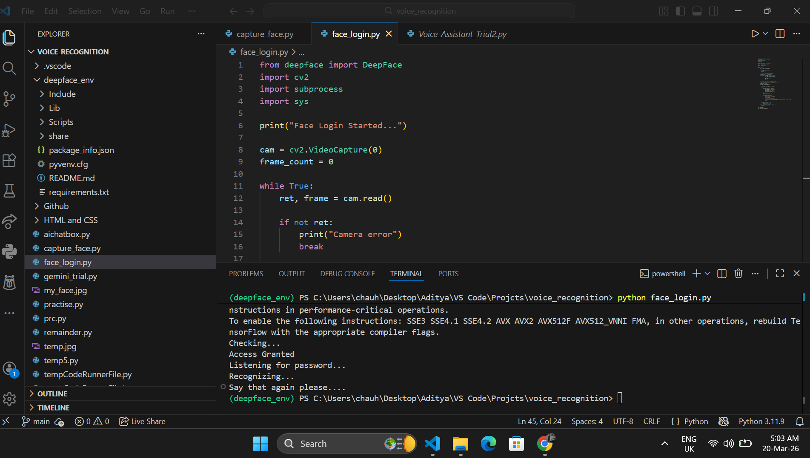

# Dash - AI Voice Assistant

Dash is a voice-controlled AI assistant with face login, Gemini AI integration, Wikipedia search, system controls, and image analysis.



---

## Features

- Face login using DeepFace
- Voice command recognition
- Gemini AI chat integration
- Open websites (YouTube, Google, Instagram, Gmail, ChatGPT)
- Search and open folders by voice
- Describe images via URL using Gemini Vision
- Wikipedia search
- Tell current time
- Play local music

---

## Folder Structure

```
dash-ai-voice-assistant/
├── assets/                  # Static assets
├── demo/                    # Demo screenshots and video
├── modules/
│   ├── folder_search.py     # Search folders on the system
│   ├── gemini_ai.py         # Gemini AI API wrapper
│   ├── image_analysis.py    # Image description via Gemini Vision
│   ├── speak.py             # Text-to-speech engine
│   ├── system_commands.py   # Open apps/websites, get time
│   └── voice_inout.py       # Microphone input & speech recognition
├── capture_face.py          # Capture and save your face for login
├── face_login.py            # Face verification entry point
├── main.py                  # Main assistant logic
└── requirements.txt
```

---

## Prerequisites

- Python 3.9 – 3.10 (recommended for TensorFlow 2.12 compatibility)
- A working webcam and microphone
- Google Gemini API key

---

## Setup & Run

### 1. Clone the repository

```bash
git clone <repo-url>
cd dash-ai-voice-assistant
```

### 2. Install dependencies

```bash
pip install -r requirements.txt
```

> If `pyaudio` fails to install on Windows, use:
> ```bash
> pip install pipwin
> pipwin install pyaudio
> ```

### 3. Set your Gemini API key

```bash
# Windows (Command Prompt)
set GEMINI_API_KEY=<your_api_key>

# Windows (PowerShell)
$env:GEMINI_API_KEY="<your_api_key>"
```

### 4. Capture your face for login

```bash
python capture_face.py
```

- A camera window will open. Press **S** to save your face as `my_face.jpg`.

### 5. Run the assistant

**With face login (recommended):**
```bash
python face_login.py
```

**Without face login:**
```bash
python main.py
```

> On first run via `main.py`, you will be asked for a voice password.

---

## Voice Commands

| Command | Action |
|---|---|
| `gemini` | Start Gemini AI chat session |
| `wikipedia <topic>` | Search Wikipedia |
| `open youtube/google/instagram/gmail/chat gpt` | Open website |
| `open chrome` / `open vs code` | Open application |
| `open folder` | Search and open a folder by name |
| `describe this image` | Describe an image from a URL |
| `play music` | Play music from local directory |
| `tell me the time` | Speak current time |
| `exit` | Quit the assistant |

---

## Notes

- The face login compares your live camera feed against `my_face.jpg` every 30 frames.
- Music playback is configured to `C:\Users\chauh\Desktop\Aditya\Songs` — update the path in `main.py` as needed.
- VS Code and Riot Client paths in `main.py` are machine-specific; update them if needed.
